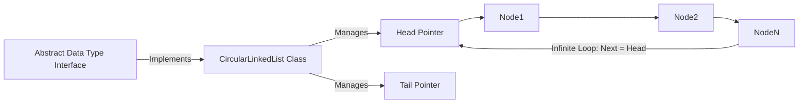

# Data Structures & Algorithms (DSA): Circular Linked List

[]()
[]()
[]()

## Overview
This repository completes the foundational Linked List trilogy, serving as an enterprise-grade Java implementation of the Circular Linked List data structure. By explicitly linking the tail node's memory pointer back to the head node, it creates a closed, infinite-iteration loop—an essential architecture for continuous data streams and resource scheduling algorithms.

## Problem Statement
Standard Singly and Doubly Linked Lists terminate at a `null` pointer, meaning iteration must halt and mathematically reset to $O(N)$ if the data needs to be traversed again. In systems programming—such as CPU Round-Robin process scheduling or multiplayer turn-based game engines—continuous, non-terminating iteration is mandatory. This repository solves that by implementing an infinitely continuous memory ring.

## Key Features
- **Infinite Traversal Loop:** Explicit memory manipulation ensuring the Tail node's `next` pointer always resolves to the Head node instead of `null`.
- **Strict OOP Abstractions:** Decouples the Abstract Data Type (ADT) interface from the concrete `CircularLinkedList` implementation.
- **$O(1)$ Tail Ingestion:** Architected with optimal constant-time complexity for inserting data at the end of the loop, facilitating high-speed Queue-like behavior.
- **Isolated Package Structure:** Divided into specific Java subpackages (`adt/`, `node/`, `list/`) to emulate enterprise build environments.

## Architecture



## Technology Stack
- **Language:** Java (JDK 11+)
- **Testing:** Python `unittest` (Javac Wrapper)
- **Documentation:** GitHub Flavored Markdown (GFM)

## Project Structure
```text
circular-linked-list/
├── src/
│   ├── adt/                 # Core Interface contracts
│   ├── node/                # Generic Node payload logic
│   ├── list/                # Concrete Circular Linked List implementation
│   └── main/                # Application drivers
├── tests/                   # Automated compilation verification
└── README.md                # System documentation
```

## Installation
Ensure the Java Development Kit (JDK) is installed natively on your OS.
```bash
git clone https://github.com/krsna016/circular-linked-list.git
cd circular-linked-list/src
```

## Usage
Compile and execute the specific driver class directly, mapping the sourcepath to resolve cross-package dependencies:
```bash
javac -sourcepath . main/Main.java
java main.Main
```

## Examples
*Example logical mapping demonstrating the infinite loop closure:*
```java
public void insertAtTail(T data) {
    Node<T> newNode = new Node<>(data);
    if (head == null) {
        head = newNode;
        newNode.next = head; // Point to self (Closed Loop)
    } else {
        tail.next = newNode;
        newNode.next = head; // Point tail back to head (Closed Loop)
    }
    tail = newNode;
}
```

## Screenshots
> [!NOTE]
> *Educational algorithms execute via standard terminal output without GUI interactions.*

## Visual Demonstrations
> [!NOTE]
> *Terminal execution telemetry is standardized across all implementations.*

## Testing
We utilize a dynamic Python subprocess wrapper to programmatically test `javac` compilation across all Java packages concurrently. This ensures that the deep package-level inheritance and interface contracts compile cleanly without missing dependencies.
```bash
python3 -m unittest discover tests/
```

## Performance Notes
- **Infinite Loop Risk:** Engineers implementing traversing functions (e.g., `printList()`) must implement strict mathematical constraints (like `do-while` loops checking if `current == head`) to avoid catastrophic infinite execution panics.

## Future Improvements
- **Maven/Gradle Integration:** Refactor the repository to utilize a standard `pom.xml` or `build.gradle` file, allowing native integration of JUnit 5 testing frameworks rather than relying on subprocess wrappers.
- **Round-Robin Simulator:** Implement a CPU scheduling simulator utilizing this Circular Linked List to assign static time-slices to dummy OS processes.

## Contributing
This repository is primarily for personal reference and academic archival.

## License
Licensed under the MIT License.
